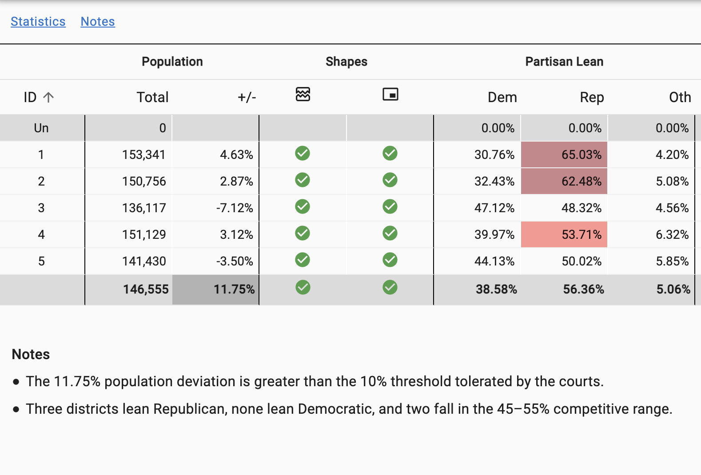

# Project3
DU Data Analysis Project 3 - Redistricting El Paso County, CO County Commissioner Districts

## Description
This project focuses on the county commissioner redistricting happening now in El Paso County, CO.

## Background
The county is required to redistrict this year based on the 2020 census.
The image below shows information for the 5 current districts. This information is based on the 2020 Census and voter registration data in El Paso County, and is curtasy of the Dave's Redistricting website (https://davesredistricting.org).
Note that per current districting requirements, 3 of the 5 districts have too much population relative to the other districts.

## Redistricing Goals
Fair redistricting is reflected by the following attributes of districts:
* Population sizes are within +- 5%
* Compliance with the Voting Rights Act of 1965
* Compactness
* Contiguousness
* Municipalities and communities of interest are kept whole within a single district
* Political competitiveness

## Dashboard

### How to Run
Run the dashboard as follows:
1. Run `python app.py` on the command line
2. Open a browser window (chrome recommended) and enter `http://127.0.0.1:5000` as the URL.

### Functionality

This dashboard allows the display of 3 different county commissioner district maps, including the current district map. Each map has the county commissioner districts highlighed in separate colors and overlays a precinct outline map which overlays an open street map (https://www.openstreetmap.org) of El Paso County, CO.
The user may select the map of interest using a *Leaflet* layers control.
Above the map, are panels which display information about all the districts on the map selected.
The user may choose one of 3 data groups from a dropdown. Data is then displayed in each district panel in graphical form.
The data groups are:
* Population (as of the 2020 census)
  - Total population
  - Voting age population (VAP)
  - Percentage deviation of district population from the total county population divided by the number of districts.
* Political Competitiveness
  - percentage of political party registrations
  - results from a "generic" county-wide race in the 2022 election (assessor's race)
  - Political Voter Index (PVI) from Dave's Redistricting which is a composite of national 2016-2020 elections.
* Demographic information
  - Race information from the 2020 census
As district maps are selected and data groups are selected, all dashboard panel information is updated.

### Software Used

The server side application is a *Flask* app written in python. (https://flask.palletsprojects.com/en/2.3.x/)
The client side includes HTML/CSS and Javascript.
Javascript libraries include:
* *D3* (https://d3js.org/)
* *Leaflet* (https://leafletjs.com/)
* *Bootstrap* (https://getbootstrap.com/)
* *Chart.js* (https://www.chartjs.org/)

The database used is *sqlite3*. The database was created using python code in jupyter notebooks.

### Data Sources
My data sources were:
* *Dave's Redistricting* website (https://davesredistricting.org). Data (exported as geoJSON):
  - The current county commissioner district map and two district maps being proposed.
  - 2020 census data for the districts in each of those maps
  - 2016-2020 composite Political Voter Index (PVI) for county precincts.
* *The El Paso County Elections Department* (https://clerkandrecorder.elpasoco.com/elections/):
  - GIS data for the country precinct lines. I converted this data to geoJSON with the *org2org* tool from https://gdal.org/programs/ogr2ogr.html
  - 2022 election results
  - A county precinct map for reference (PDF)
